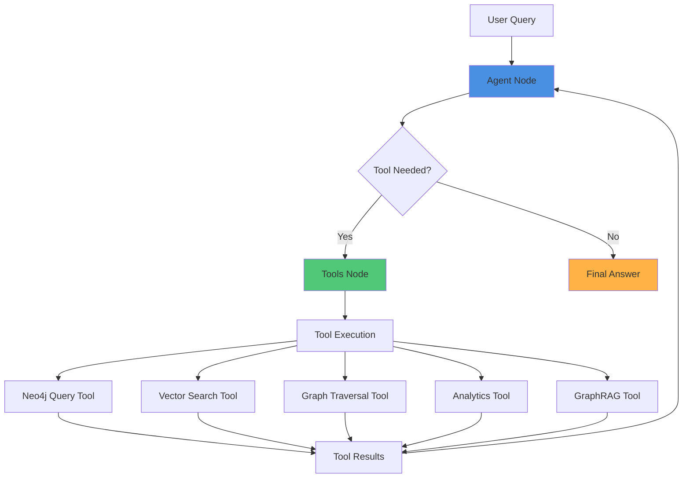

# Agent System Architecture

LangGraph-based agentic AI system for healthcare knowledge graph queries using the ReAct (Reasoning + Acting) paradigm.

## 🏗️ Architecture Diagram



## 🛠️ Custom Tools

### 1. **Neo4j Query Tool** (`neo4j_tool.py`)
Direct Cypher query execution for specific entity lookups.

**Capabilities:**
- `patient_history` - Complete medical timeline
- `medication_info` - Drug details and conditions treated
- `condition_lookup` - Find patients by diagnosis
- `encounter_details` - Specific encounter information
- `custom` - Execute custom Cypher queries

**Status:** ✅ Fully operational

---

### 2. **Vector Search Tool** (`vector_search_tool.py`)
Semantic similarity search using vector embeddings.

**Capabilities:**
- Find semantically similar conditions, medications, procedures, observations
- Fuzzy concept matching
- Returns top-k results with similarity scores

**Status:** ⚠️ Infrastructure complete (awaiting semantic embeddings)

---

### 3. **Graph Traversal Tool** (`graph_traversal_tool.py`)
Multi-hop graph navigation for complex pattern discovery.

**Capabilities:**
- `patient_journey` - Temporal medical timeline
- `condition_treatment_path` - Common treatments for conditions
- `medication_interactions` - Co-prescription patterns
- `similar_patient_cohort` - Find similar patients
- `temporal_patterns` - Sequential medical events

**Status:** ✅ Fully operational

---

### 4. **Graph Analytics Tool** (`analytics_tool.py`)
Population-level statistics and aggregate insights.

**Capabilities:**
- Node counts by type
- Top conditions and medications
- Patient demographics
- Encounter statistics

**Status:** ✅ Fully operational

---

### 5. **GraphRAG Tool** (`graphrag_tool.py`)
Hybrid retrieval combining semantic search + graph traversal.

**Capabilities:**
- `semantic_then_traverse` - Semantic search → graph exploration
- `traverse_then_semantic` - Graph traversal → semantic ranking
- `hybrid_combined` - Parallel execution with result merging

**Status:** ⚠️ Graph component operational, semantic awaiting embeddings

---

### Supporting Tools

**Vector Embedding Tool** (`vector_embedding_tool.py`)
- Generates and manages vector embeddings
- Creates Neo4j vector indexes
- Supports OpenAI, sentence-transformers, or hash-based embeddings

## 🔄 Agent Workflow

1. **User submits query** → Enters as `HumanMessage`
2. **Agent Node** → LLM analyzes query with conversation history
3. **Decision** → LLM decides to call tool(s) or provide answer
4. **Tool Execution** → Selected tools run in parallel if independent
5. **Results** → Tool outputs added as `ToolMessage` to history
6. **Loop** → Agent re-evaluates with new information
7. **Termination** → When sufficient info gathered, returns final answer

## 📁 File Structure

```
agent/
├── __init__.py              # Package initialization
├── graph.py                 # LangGraph workflow & agent logic
├── state.py                 # Agent state schema (TypedDict)
└── tools/                   # Custom tools
    ├── __init__.py
    ├── neo4j_tool.py       # Cypher queries
    ├── analytics_tool.py   # Statistics
    ├── vector_search_tool.py # Semantic search
    ├── graph_traversal_tool.py # Multi-hop navigation
    ├── graphrag_tool.py    # Hybrid retrieval
    └── vector_embedding_tool.py # Embedding management
```

## 🚀 Usage

```python
from agent.graph import run_agent

# Ask a question
answer = run_agent("What are the most common conditions?")
print(answer)
```

## 🔗 Integration

The agent is exposed via FastAPI in `api/main.py`:
- **POST /ask** - Query the agent
- **GET /graph-info** - Graph metadata